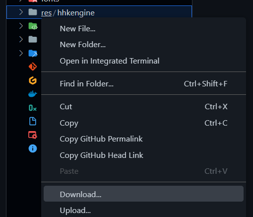

# CPGameTemplate
A test that could become the next CP App Template
Based on the [hhk Engine](https://github.com/s3ansh33p/hhkEngine)


TODO: update this readme ...


## Usage
First, fork this repo to work on your own :
<a href="https://github.com/TheRainbowPhoenix/CPAppTemplate/fork">
  
</p>

Find a cool name for it :
<a href="https://github.com/TheRainbowPhoenix/CPAppTemplate/fork">
  
</p>

Forking will take a few seconds.

Once done, open the forked repo on a codespace :
<p>
   Codespaces > Create codespace on master" width="300px"/>
</p>

You'll see a message telling it's creating, please wait for a while


<p>
  
</p>


On the terminal, use `make hhk` to generate an HHK file, or `make bin` to generate an BIN (smaller) that's both ready to get uploaded to your calculator

<p>
  
</p>

You can now download generated files. If you run into issues during this step, please see [Getting support](#getting-support)

This need to be done in two steps. First you'll need the hhk (and/or bin) generated :

<p>
  
</p>

Then you'll need to download the whole "res" folder. Right click on it and choose "Download", then when prompted choose an empty folder to copy the file to. You'll be asked by the browser to "Let site view files" and "Save changes to <your_folder>", allow both to make the file copied at the right location. Your cursor should blink for a while and after a minute every file will be in <your_folder> you choosed.

<p>
  
</p>


Open the destination folder and check if the folder "res" is in there. It's used by the games to have their assets (fonts and images) loaded

Plug your calculator on your desktop and choose "USB Flash" mode.
<p>
  
</p>


Go into your file explorer, on the "USB Drive" that's the calculator, and then copy at the root of it your `game_template.hhk` (or/and `game_template.bin`) and copy the "res" folder at the root of the calculator drive too, otherwise your game will freeze.


Then, eject the Classpad Mass Storage device by right clicking on notifications > "Safely remove device

Finally on your calculator, go in "System" from the home screen, "System" from the top menu and "Hollyhock-2 Launcher"
You should see the "My app name" on the list (twice if you did both the HHK and the BIN) and you can "Run" it
<p>
  
</p>

You should then see a beautiful demo with "Hello world" and custom shapes on the screen ! Congratulations !

## What to do next

You can edit the `main.cpp` file to add your own logic and build whatever you want. Be sure to remember that you're coding on embed hardware, and most of the C/C++ funtion you know won't work there (say `printf`).

First thing you can do is edit the first lines that describe your app :
```
APP_NAME("My game name")
APP_DESCRIPTION("My First Game")
APP_AUTHOR("My name")
APP_VERSION("1.0")
```

Then, you can take a look at the [beginners tutorials](#TODO) to build some simple programs and even small games.

For more information, you can explore the [docs](https://classpaddev.github.io/) or get some inspiration by looking at the [demos](#TODO)

## Getting support

If you need help, feel free to join our community both in [Discord](https://discord.gg/knpcNJTzpd) and [Reddit](https://www.reddit.com/r/fxcp400/)

## Why is there HHK and BIN
Design decisions made us split between ELF-compatible "hhk" and raw executable binary (or shellcode, kinda) "bin"


## Adding your own assets and fonts 

TODO: how to use tools, and create make target with python installed on the docker file

## Contributors

- [@s3ash33p](https://www.github.com/s3ash33p)
- [@InterChan](https://github.com/InterChan374)
- [@SnailMath](https://github.com/SnailMath/)
- [@DasHeiligeDoenerhuhn](https://github.com/DasHeiligeDoenerhuhn)
- [@PC](https://github.com/TheRainbowPhoenix)
